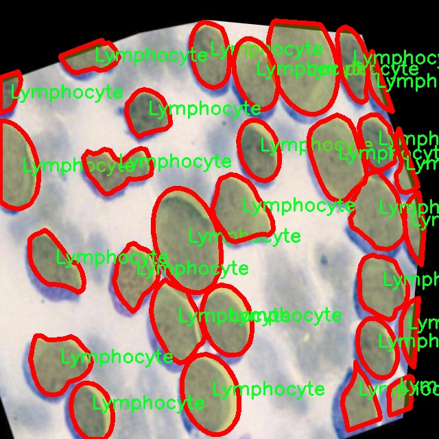

# 血液细胞图像分割系统源码＆数据集分享
 [yolov8-seg-C2f-ODConv＆yolov8-seg-fasternet-bifpn等50+全套改进创新点发刊_一键训练教程_Web前端展示]

### 1.研究背景与意义

项目参考[ILSVRC ImageNet Large Scale Visual Recognition Challenge](https://gitee.com/YOLOv8_YOLOv11_Segmentation_Studio/projects)

项目来源[AAAI Global Al lnnovation Contest](https://kdocs.cn/l/cszuIiCKVNis)

研究背景与意义

随着医学影像技术的快速发展，血液细胞的自动化识别与分割已成为临床诊断和疾病监测中的重要研究方向。血液细胞的分类与计数不仅对血液病的早期诊断至关重要，而且在疾病的监测和治疗效果评估中也发挥着重要作用。传统的血液细胞分析方法多依赖于人工显微镜观察，耗时且容易受到人为因素的影响，导致结果的不一致性。因此，开发高效、准确的自动化血液细胞图像分割系统显得尤为重要。

近年来，深度学习技术在图像处理领域取得了显著进展，尤其是卷积神经网络（CNN）在图像分类和分割任务中的应用，为血液细胞的自动识别提供了新的解决方案。YOLO（You Only Look Once）系列模型以其快速和高效的特性，成为实时目标检测领域的佼佼者。YOLOv8作为该系列的最新版本，结合了多种先进的深度学习技术，展现出更高的检测精度和更快的处理速度。然而，针对血液细胞图像的分割任务，YOLOv8仍存在一定的局限性，尤其是在细胞边界模糊和细胞重叠的情况下，模型的分割性能亟待提升。

本研究旨在基于改进的YOLOv8模型，构建一个高效的血液细胞图像分割系统。我们将利用一个包含3100张图像的数据集，该数据集涵盖了10种不同类型的血液细胞，包括嗜碱性粒细胞、嗜酸性粒细胞、红芽细胞、入侵细胞、淋巴细胞、单核细胞、髓母细胞、中性粒细胞、血小板和红细胞。这些细胞类型在临床上具有重要的生物学意义，其数量和形态的变化往往与多种疾病的发生和发展密切相关。因此，准确的细胞分割和分类不仅有助于提高临床诊断的效率，也为基础医学研究提供了重要的数据支持。

通过对YOLOv8模型的改进，我们将重点解决细胞重叠、边界模糊等问题，提升模型在复杂背景下的分割精度。具体而言，我们将引入多尺度特征融合、注意力机制等技术，以增强模型对细胞特征的捕捉能力。此外，结合数据增强技术，我们将进一步丰富训练数据，提高模型的泛化能力。

本研究的意义在于，不仅为血液细胞的自动化分析提供了一种新的解决方案，也为深度学习在医学图像处理领域的应用提供了新的思路。通过构建高效的血液细胞图像分割系统，我们期望能够推动血液病的早期诊断和治疗监测的智能化进程，最终实现更为精准的个性化医疗。同时，本研究也将为相关领域的研究者提供有价值的参考，促进医学影像分析技术的进一步发展。

### 2.图片演示


##### 注意：由于此博客编辑较早，上面“2.图片演示”和“3.视频演示”展示的系统图片或者视频可能为老版本，新版本在老版本的基础上升级如下：（实际效果以升级的新版本为准）

  （1）适配了YOLOV8的“目标检测”模型和“实例分割”模型，通过加载相应的权重（.pt）文件即可自适应加载模型。

  （2）支持“图片识别”、“视频识别”、“摄像头实时识别”三种识别模式。

  （3）支持“图片识别”、“视频识别”、“摄像头实时识别”三种识别结果保存导出，解决手动导出（容易卡顿出现爆内存）存在的问题，识别完自动保存结果并导出到tempDir中。

  （4）支持Web前端系统中的标题、背景图等自定义修改，后面提供修改教程。

  另外本项目提供训练的数据集和训练教程,暂不提供权重文件（best.pt）,需要您按照教程进行训练后实现图片演示和Web前端界面演示的效果。

### 3.视频演示

[3.1 视频演示](https://www.bilibili.com/video/BV1bbSvYyExz/)

### 4.数据集信息展示

##### 4.1 本项目数据集详细数据（类别数＆类别名）

nc: 10
names: ['Basophil', 'Eosinophil', 'Erythroblast', 'Intrusion', 'Lymphocyte', 'Monocyte', 'Myelocyte', 'Neutrophil', 'Platelet', 'RBC']


##### 4.2 本项目数据集信息介绍

数据集信息展示

在本研究中，我们采用了名为“Oussama”的数据集，以训练和改进YOLOv8-seg模型，旨在实现对血液细胞图像的高效分割。该数据集包含10个不同的细胞类别，涵盖了血液中常见的细胞类型，为我们的研究提供了丰富的样本和多样化的特征。这些细胞类别包括：嗜碱性粒细胞（Basophil）、嗜酸性粒细胞（Eosinophil）、红芽球（Erythroblast）、入侵细胞（Intrusion）、淋巴细胞（Lymphocyte）、单核细胞（Monocyte）、幼红细胞（Myelocyte）、中性粒细胞（Neutrophil）、血小板（Platelet）以及红细胞（RBC）。每一种细胞类型在血液中的功能和形态特征各不相同，这为我们的图像分割任务提供了挑战和机遇。

“Oussama”数据集的构建经过精心设计，确保了样本的多样性和代表性。每个类别的细胞图像均经过专业的标注，确保其在分割任务中的准确性和有效性。这些图像不仅涵盖了不同的细胞形态，还考虑了不同的拍摄条件和光照变化，使得模型在训练过程中能够学习到更为广泛的特征。这种多样性对于提高模型的泛化能力至关重要，尤其是在处理临床数据时，模型需要能够适应不同的样本和条件。

在数据集的使用过程中，我们将采用数据增强技术，以进一步提升模型的鲁棒性。通过对原始图像进行旋转、缩放、翻转和颜色调整等操作，我们能够生成更多的训练样本，从而有效地减少过拟合现象。此外，数据集中的每个类别均具有一定数量的样本，确保了在训练过程中各个类别的均衡性。这种均衡性对于分类模型的性能至关重要，能够有效避免模型对某些类别的偏倚。

在模型训练的过程中，我们将使用交叉验证的方法，以确保模型在不同数据子集上的表现一致性。通过不断调整模型的超参数和网络结构，我们期望能够找到最佳的配置，以实现对血液细胞的精准分割。特别是在处理如入侵细胞（Intrusion）这类相对少见的细胞类型时，模型的表现尤为重要，因为这些细胞在临床诊断中可能具有重要的指示意义。

最终，我们的目标是通过“Oussama”数据集的训练，使得YOLOv8-seg模型能够在血液细胞图像分割任务中达到更高的准确率和更快的处理速度。这不仅将推动血液细胞分析技术的发展，也将为临床医学提供更为可靠的辅助工具，帮助医生在疾病诊断和治疗过程中做出更为准确的判断。通过对数据集的深入分析和模型的不断优化，我们期待能够在血液细胞图像分割领域取得突破性进展。





### 5.全套项目环境部署视频教程（零基础手把手教学）

[5.1 环境部署教程链接（零基础手把手教学）](https://www.bilibili.com/video/BV1jG4Ve4E9t/?vd_source=bc9aec86d164b67a7004b996143742dc)


[5.2 安装Python虚拟环境创建和依赖库安装视频教程链接（零基础手把手教学）](https://www.bilibili.com/video/BV1nA4VeYEze/?vd_source=bc9aec86d164b67a7004b996143742dc)

### 6.手把手YOLOV8-seg训练视频教程（零基础小白有手就能学会）

[6.1 手把手YOLOV8-seg训练视频教程（零基础小白有手就能学会）](https://www.bilibili.com/video/BV1cA4VeYETe/?vd_source=bc9aec86d164b67a7004b996143742dc)


按照上面的训练视频教程链接加载项目提供的数据集，运行train.py即可开始训练



     Epoch   gpu_mem       box       obj       cls    labels  img_size
     1/200     0G   0.01576   0.01955  0.007536        22      1280: 100%|██████████| 849/849 [14:42<00:00,  1.04s/it]
               Class     Images     Labels          P          R     mAP@.5 mAP@.5:.95: 100%|██████████| 213/213 [01:14<00:00,  2.87it/s]
                 all       3395      17314      0.994      0.957      0.0957      0.0843

     Epoch   gpu_mem       box       obj       cls    labels  img_size
     2/200     0G   0.01578   0.01923  0.007006        22      1280: 100%|██████████| 849/849 [14:44<00:00,  1.04s/it]
               Class     Images     Labels          P          R     mAP@.5 mAP@.5:.95: 100%|██████████| 213/213 [01:12<00:00,  2.95it/s]
                 all       3395      17314      0.996      0.956      0.0957      0.0845

     Epoch   gpu_mem       box       obj       cls    labels  img_size
     3/200     0G   0.01561    0.0191  0.006895        27      1280: 100%|██████████| 849/849 [10:56<00:00,  1.29it/s]
               Class     Images     Labels          P          R     mAP@.5 mAP@.5:.95: 100%|███████   | 187/213 [00:52<00:00,  4.04it/s]
                 all       3395      17314      0.996      0.957      0.0957      0.0845


### 7.50+种全套YOLOV8-seg创新点代码加载调参视频教程（一键加载写好的改进模型的配置文件）

[7.1 50+种全套YOLOV8-seg创新点代码加载调参视频教程（一键加载写好的改进模型的配置文件）](https://www.bilibili.com/video/BV1Hw4VePEXv/?vd_source=bc9aec86d164b67a7004b996143742dc)

### 8.YOLOV8-seg图像分割算法原理

原始YOLOv8-seg算法原理

YOLOv8-seg算法是YOLO系列的最新版本，代表了目标检测与分割技术的一个重要进步。该算法在YOLOv7的基础上进行了深度优化，结合了更为复杂的卷积神经网络结构，旨在提升目标检测的精度和速度。YOLOv8-seg不仅能够识别图像中的目标，还能对目标进行精确的像素级分割，这使得它在许多应用场景中展现出极大的潜力。

YOLOv8-seg的核心思想是将整个图像作为输入，直接在图像上进行目标检测和定位，而不依赖于传统的滑动窗口或区域提议方法。这种端到端的处理方式大大提高了检测的效率，减少了计算时间。此外，YOLOv8-seg引入了多尺度训练和测试的技术，利用特征金字塔网络（FPN）来处理不同尺度的特征信息，从而增强了模型对各种尺寸目标的检测能力。

在网络结构方面，YOLOv8-seg依然采用了跨级结构（Cross Stage Partial, CSP）的设计理念，这种结构能够有效地减轻模型的计算负担，同时保持高效的特征提取能力。与之前的版本相比，YOLOv8-seg对C3模块进行了优化，采用了更轻量的结构，以提高整体的计算效率。此外，YOLOv8-seg保留了空间金字塔池化模块，进一步增强了对多尺度特征的处理能力。

YOLOv8-seg的另一个重要创新在于其损失函数的设计。该算法采用了新的损失策略，通过变焦损失来计算分类损失，并结合数据平均保真度损失和完美交并比损失来计算边界框损失。这种新的损失计算方式使得YOLOv8-seg在目标检测时能够更加准确地评估目标的边界，从而提升了检测的精度。

在特征融合方面，YOLOv8-seg采用了特征金字塔网络与路径聚合网络的结合，以便更好地整合来自不同层次的特征信息。通过引入BiFPN网络，YOLOv8-seg能够高效地进行双向跨尺度连接和加权特征融合，从而提升模型对不同尺度特征信息的提取速度。这种设计使得YOLOv8-seg在处理复杂场景时表现得更加出色，能够有效应对多样化的目标检测任务。

值得注意的是，YOLOv8-seg的轻量化设计使其在移动设备和边缘计算环境中具有广泛的应用前景。通过使用更轻量的C2F模块替代传统的C3模块，YOLOv8-seg在保证检测精度的同时，显著降低了模型的复杂度。这一特性使得YOLOv8-seg能够在资源受限的环境中运行，满足实时检测的需求。

在实际应用中，YOLOv8-seg展现出了极高的灵活性和适应性。无论是在智能监控、自动驾驶还是人脸识别等领域，YOLOv8-seg都能够提供快速且准确的目标检测与分割服务。其高效的性能使得它成为许多行业的首选解决方案，推动了计算机视觉技术的进一步发展。

总的来说，YOLOv8-seg算法通过对网络结构、损失函数和特征融合方法的全面优化，成功地提升了目标检测与分割的性能。其创新的设计理念和高效的计算能力，使得YOLOv8-seg在众多目标检测算法中脱颖而出，成为了当前计算机视觉领域的一个重要里程碑。随着技术的不断进步，YOLOv8-seg将继续为各种应用场景提供强大的支持，推动智能化时代的到来。


### 9.系统功能展示（检测对象为举例，实际内容以本项目数据集为准）

图9.1.系统支持检测结果表格显示

  图9.2.系统支持置信度和IOU阈值手动调节

  图9.3.系统支持自定义加载权重文件best.pt(需要你通过步骤5中训练获得)

  图9.4.系统支持摄像头实时识别

  图9.5.系统支持图片识别

  图9.6.系统支持视频识别

  图9.7.系统支持识别结果文件自动保存

  图9.8.系统支持Excel导出检测结果数据


### 10.50+种全套YOLOV8-seg创新点原理讲解（非科班也可以轻松写刊发刊，V11版本正在科研待更新）

#### 10.1 由于篇幅限制，每个创新点的具体原理讲解就不一一展开，具体见下列网址中的创新点对应子项目的技术原理博客网址【Blog】：


[10.1 50+种全套YOLOV8-seg创新点原理讲解链接](https://gitee.com/qunmasj/good)

#### 10.2 部分改进模块原理讲解(完整的改进原理见上图和技术博客链接)【如果此小节的图加载失败可以通过CSDN或者Github搜索该博客的标题访问原始博客，原始博客图片显示正常】
### YOLOv8简介
#### Yolov8网络模型
Yolov8n的网络分为输入端、主干网( Back-bone) 、Neck模块和输出端4个部分（图4)。输
人端主要有马赛克( Mosaic）数据增强、自适应锚框计算和自适应灰度填充。主干网有Conv、C2和SPPF结构，其中，C2r模块是对残差特征进行学习的主要模块，该模块仿照Yolov7的ELAN结构,通过更多的分支跨层连接，丰富了模型的梯度流，可形成一个具有更强特征表示能力的神经网络模
块。Neck模块采用PAN ( path aggregation nelwOrk ,结构，可加强网络对不同缩放尺度对象特征融合的
能力。输出端将分类和检测过程进行解耦，主要包括损失计算和目标检测框筛选，其中，损失计算过程主要包括正负样本分配策略和 Loss计算，Yolov8n 网络主要使用TaskAlignedAssignerl 10]方法，即根据分类与回归的分数加权结果选择正样本;Loss计算包括分类和回归2个分支，无Ob-jecIness分支。分类分支依然采用BCE Loss，回归分支则使用了Distribution Focal Loss!11〕和CIOU( complele inlersection over union)损失函数。

### 可扩张残差（DWR）注意力模块
当前的许多工作直接采用多速率深度扩张卷积从一个输入特征图中同时捕获多尺度上下文信息，从而提高实时语义分割的特征提取效率。 然而，这种设计可能会因为结构和超参数的不合理而导致多尺度上下文信息的访问困难。 为了降低绘制多尺度上下文信息的难度，我们提出了一种高效的多尺度特征提取方法，该方法分解了原始的单步特征提取方法方法分为两个步骤，区域残差-语义残差。 在该方法中，多速率深度扩张卷积在特征提取中发挥更简单的作用：根据第一步提供的每个简明区域形式特征图，在第二步中使用一个所需的感受野执行简单的基于语义的形态过滤 一步，提高他们的效率。 此外，扩张率和扩张卷积的容量每个网络阶段都经过精心设计，以充分利用所有可以实现的区域形式的特征图。 因此，我们分别为高层和低层网络设计了一种新颖的扩张式残差（DWR）模块和简单倒置残差（SIR）模块。


首先，该博客引入了一个Dilation-wise Residual（DWR）模块，用于提取网络高层的特征，如图2a所示。多分支结构用于扩展感受野，其中每个分支采用不同空洞率的空洞深度卷积。
然后，专门设计了一个Simple Inverted Residual（SIR）模块来提取网络低层的特征，如图2b所示。该模块仅具有3×3的微小感受野，但使用inverted bottleneck式结构来扩展通道数量，确保更强的特征提取能力。
最后，基于DWR和SIR模块，构建了一个编码器-解码器风格的网络DWRSeg，其中解码器采用了简单的类似FCN的结构。解码器使用来自最后两个阶段的强语义信息直接对特征图进行上采样，然后将它们与来自较低阶段的特征图（包含丰富的详细信息）拼接起来，以进行最终预测。


### 11.项目核心源码讲解（再也不用担心看不懂代码逻辑）

#### 11.1 ultralytics\models\yolo\pose\__init__.py

下面是对给定代码的核心部分进行提炼和详细注释的结果：

```python
# 导入必要的模块
# PosePredictor：用于姿态预测的类
# PoseTrainer：用于训练姿态模型的类
# PoseValidator：用于验证姿态模型的类
from .predict import PosePredictor
from .train import PoseTrainer
from .val import PoseValidator

# 定义模块的公共接口
# __all__ 变量用于指定当使用 from <module> import * 时，哪些类或函数会被导入
__all__ = 'PoseTrainer', 'PoseValidator', 'PosePredictor'
```

### 代码分析与注释：

1. **模块导入**：
   - `from .predict import PosePredictor`：从当前包的 `predict` 模块中导入 `PosePredictor` 类，该类负责进行姿态预测。
   - `from .train import PoseTrainer`：从当前包的 `train` 模块中导入 `PoseTrainer` 类，该类用于训练姿态识别模型。
   - `from .val import PoseValidator`：从当前包的 `val` 模块中导入 `PoseValidator` 类，该类用于验证训练好的姿态模型的性能。

2. **公共接口定义**：
   - `__all__` 是一个特殊变量，用于定义模块的公共接口。当使用 `from <module> import *` 语句时，只有在 `__all__` 中列出的名称会被导入。这有助于控制模块的可见性和避免名称冲突。
   - 在这里，`__all__` 包含了三个类：`PoseTrainer`、`PoseValidator` 和 `PosePredictor`，表示这些类是该模块的核心功能部分。

通过以上分析和注释，可以清晰地理解该代码的结构和功能。

这个文件是Ultralytics YOLO项目中的一个初始化文件，位于`ultralytics/models/yolo/pose/`目录下。它的主要功能是定义该模块的公共接口。

首先，文件开头的注释部分表明这是Ultralytics YOLO项目的一部分，并且遵循AGPL-3.0许可证。这是一个开源许可证，允许用户自由使用、修改和分发代码，但要求在分发时也必须提供源代码。

接下来，文件通过`from .predict import PosePredictor`、`from .train import PoseTrainer`和`from .val import PoseValidator`三行代码导入了三个类或模块。这些类分别负责不同的功能：`PosePredictor`用于姿态预测，`PoseTrainer`用于训练模型，而`PoseValidator`则用于验证模型的性能。这种结构使得代码的组织更加清晰，并且便于维护和扩展。

最后，`__all__`变量被定义为一个元组，包含了`PoseTrainer`、`PoseValidator`和`PosePredictor`这三个名称。这意味着当使用`from module import *`的方式导入该模块时，只会导入这三个类。这是一种控制模块导出内容的方式，确保用户只接触到模块的公共接口，而不暴露内部实现细节。

总的来说，这个初始化文件的作用是将姿态估计相关的功能模块整合在一起，并提供一个清晰的接口供外部使用。

#### 11.2 ultralytics\nn\modules\transformer.py

以下是代码中最核心的部分，并附上详细的中文注释：

```python
import torch
import torch.nn as nn
import torch.nn.functional as F

class TransformerEncoderLayer(nn.Module):
    """定义单个Transformer编码器层。"""

    def __init__(self, c1, cm=2048, num_heads=8, dropout=0.0, act=nn.GELU(), normalize_before=False):
        """初始化TransformerEncoderLayer，设置参数。"""
        super().__init__()
        self.ma = nn.MultiheadAttention(c1, num_heads, dropout=dropout, batch_first=True)  # 多头自注意力机制
        self.fc1 = nn.Linear(c1, cm)  # 前馈网络的第一层
        self.fc2 = nn.Linear(cm, c1)  # 前馈网络的第二层
        self.norm1 = nn.LayerNorm(c1)  # 第一层归一化
        self.norm2 = nn.LayerNorm(c1)  # 第二层归一化
        self.dropout = nn.Dropout(dropout)  # dropout层
        self.dropout1 = nn.Dropout(dropout)  # 第一层dropout
        self.dropout2 = nn.Dropout(dropout)  # 第二层dropout
        self.act = act  # 激活函数
        self.normalize_before = normalize_before  # 是否在前向传播前进行归一化

    def forward(self, src, src_mask=None, src_key_padding_mask=None, pos=None):
        """通过编码器模块进行前向传播。"""
        if self.normalize_before:
            return self.forward_pre(src, src_mask, src_key_padding_mask, pos)
        return self.forward_post(src, src_mask, src_key_padding_mask, pos)

    def forward_post(self, src, src_mask=None, src_key_padding_mask=None, pos=None):
        """后归一化的前向传播。"""
        q = k = self.with_pos_embed(src, pos)  # 计算查询和键
        src2 = self.ma(q, k, value=src, attn_mask=src_mask, key_padding_mask=src_key_padding_mask)[0]  # 自注意力
        src = src + self.dropout1(src2)  # 残差连接
        src = self.norm1(src)  # 归一化
        src2 = self.fc2(self.dropout(self.act(self.fc1(src))))  # 前馈网络
        src = src + self.dropout2(src2)  # 残差连接
        return self.norm2(src)  # 最终归一化

    @staticmethod
    def with_pos_embed(tensor, pos=None):
        """如果提供了位置嵌入，则将其添加到张量中。"""
        return tensor if pos is None else tensor + pos


class DeformableTransformerDecoderLayer(nn.Module):
    """可变形Transformer解码器层。"""

    def __init__(self, d_model=256, n_heads=8, d_ffn=1024, dropout=0., act=nn.ReLU(), n_levels=4, n_points=4):
        """初始化DeformableTransformerDecoderLayer，设置参数。"""
        super().__init__()
        self.self_attn = nn.MultiheadAttention(d_model, n_heads, dropout=dropout)  # 自注意力
        self.cross_attn = MSDeformAttn(d_model, n_levels, n_heads, n_points)  # 可变形交叉注意力
        self.linear1 = nn.Linear(d_model, d_ffn)  # 前馈网络的第一层
        self.linear2 = nn.Linear(d_ffn, d_model)  # 前馈网络的第二层
        self.norm1 = nn.LayerNorm(d_model)  # 归一化层
        self.norm2 = nn.LayerNorm(d_model)  # 归一化层
        self.norm3 = nn.LayerNorm(d_model)  # 归一化层

    def forward(self, embed, refer_bbox, feats, shapes, padding_mask=None, attn_mask=None, query_pos=None):
        """通过整个解码器层进行前向传播。"""
        # 自注意力
        q = k = self.with_pos_embed(embed, query_pos)
        tgt = self.self_attn(q.transpose(0, 1), k.transpose(0, 1), embed.transpose(0, 1), attn_mask=attn_mask)[0].transpose(0, 1)
        embed = embed + tgt  # 残差连接
        embed = self.norm1(embed)  # 归一化

        # 交叉注意力
        tgt = self.cross_attn(self.with_pos_embed(embed, query_pos), refer_bbox.unsqueeze(2), feats, shapes, padding_mask)
        embed = embed + tgt  # 残差连接
        embed = self.norm2(embed)  # 归一化

        # 前馈网络
        tgt2 = self.linear2(F.relu(self.linear1(embed)))  # 前馈网络
        embed = embed + tgt2  # 残差连接
        return self.norm3(embed)  # 最终归一化

    @staticmethod
    def with_pos_embed(tensor, pos):
        """如果提供了位置嵌入，则将其添加到输入张量中。"""
        return tensor if pos is None else tensor + pos
```

### 代码核心部分说明
1. **TransformerEncoderLayer**: 该类实现了Transformer的编码器层，包含多头自注意力机制和前馈网络。支持前归一化和后归一化的选择。
   - `forward` 方法根据 `normalize_before` 的值选择不同的前向传播方式。
   - `forward_post` 和 `forward_pre` 分别实现后归一化和前归一化的前向传播。

2. **DeformableTransformerDecoderLayer**: 该类实现了可变形Transformer的解码器层，包含自注意力和交叉注意力机制。
   - `forward` 方法实现了整个解码器层的前向传播，包括自注意力、交叉注意力和前馈网络。

这些类是Transformer架构的核心组件，广泛应用于各种计算机视觉任务中，如目标检测和图像分割。

这个程序文件是一个实现Transformer模块的Python代码，主要用于计算机视觉任务，特别是在YOLO（You Only Look Once）模型中。代码中定义了多个类，分别实现了Transformer的编码器层、解码器层、注意力机制等功能。

首先，`TransformerEncoderLayer`类定义了Transformer编码器的单层结构。它使用了多头自注意力机制（`nn.MultiheadAttention`）来处理输入数据，并通过前馈神经网络（两个线性层）进行特征变换。该类还支持前置和后置归一化的选择，以提高模型的稳定性和性能。

`AIFI`类是`TransformerEncoderLayer`的一个扩展，增加了对2D位置嵌入的支持，适用于处理图像数据。它通过构建二维正弦余弦位置嵌入来增强模型对空间信息的感知。

`TransformerLayer`类实现了一个基本的Transformer层，使用线性变换和多头注意力机制来进行自注意力计算。它的前向传播函数将输入数据与注意力输出相加，并通过前馈网络进行进一步处理。

`TransformerBlock`类则是一个完整的Transformer模块，支持多个层的堆叠，并可选用卷积层进行维度匹配。它通过将输入数据展平并进行位置嵌入来适应Transformer的输入格式。

`MLPBlock`和`MLP`类实现了多层感知机（MLP），前者是一个单独的MLP块，后者则是一个包含多个层的完整MLP网络。这些类通过线性层和激活函数（如GELU）构建前馈网络，适用于特征提取和分类任务。

`LayerNorm2d`类实现了2D层归一化，旨在提高模型的训练稳定性。它通过计算输入的均值和方差进行归一化，并使用可学习的权重和偏置进行调整。

`MSDeformAttn`类实现了多尺度可变形注意力机制，允许模型在不同尺度上进行特征提取，增强了对物体形状和位置变化的适应能力。它通过计算采样偏移量和注意力权重来实现对输入特征的动态调整。

`DeformableTransformerDecoderLayer`和`DeformableTransformerDecoder`类实现了可变形Transformer解码器，前者定义了解码器的单层结构，后者则是整个解码器的实现。解码器通过自注意力和交叉注意力机制结合输入特征和参考边界框，进行目标检测和定位任务。

整体而言，这个文件提供了一个灵活且强大的Transformer模块实现，适用于各种计算机视觉任务，尤其是在YOLO等目标检测模型中。通过这些模块，模型能够有效地处理图像数据，提取重要特征，并进行准确的目标定位和分类。

#### 11.3 ultralytics\models\sam\modules\decoders.py

以下是经过简化和注释的核心代码部分，主要集中在 `MaskDecoder` 类及其相关方法上：

```python
import torch
from torch import nn
from torch.nn import functional as F
from ultralytics.nn.modules import LayerNorm2d

class MaskDecoder(nn.Module):
    """
    MaskDecoder 类用于生成图像的掩码及其质量评分，采用变换器架构。
    """

    def __init__(
        self,
        transformer_dim: int,
        transformer: nn.Module,
        num_multimask_outputs: int = 3,
        activation: Type[nn.Module] = nn.GELU,
        iou_head_depth: int = 3,
        iou_head_hidden_dim: int = 256,
    ) -> None:
        """
        初始化 MaskDecoder 类。

        参数:
            transformer_dim (int): 变换器模块的通道维度
            transformer (nn.Module): 用于预测掩码的变换器
            num_multimask_outputs (int): 预测的掩码数量
            activation (nn.Module): 上采样时使用的激活函数
            iou_head_depth (int): 用于预测掩码质量的 MLP 深度
            iou_head_hidden_dim (int): 用于预测掩码质量的 MLP 隐藏维度
        """
        super().__init__()
        self.transformer_dim = transformer_dim
        self.transformer = transformer
        self.num_multimask_outputs = num_multimask_outputs

        # IoU token 和掩码 token 的嵌入
        self.iou_token = nn.Embedding(1, transformer_dim)
        self.mask_tokens = nn.Embedding(num_multimask_outputs + 1, transformer_dim)

        # 输出上采样网络
        self.output_upscaling = nn.Sequential(
            nn.ConvTranspose2d(transformer_dim, transformer_dim // 4, kernel_size=2, stride=2),
            LayerNorm2d(transformer_dim // 4),
            activation(),
            nn.ConvTranspose2d(transformer_dim // 4, transformer_dim // 8, kernel_size=2, stride=2),
            activation(),
        )

        # 用于生成掩码的超网络 MLP
        self.output_hypernetworks_mlps = nn.ModuleList([
            MLP(transformer_dim, transformer_dim, transformer_dim // 8, 3) for _ in range(num_multimask_outputs + 1)
        ])

        # 预测掩码质量的 MLP
        self.iou_prediction_head = MLP(transformer_dim, iou_head_hidden_dim, num_multimask_outputs + 1, iou_head_depth)

    def forward(
        self,
        image_embeddings: torch.Tensor,
        image_pe: torch.Tensor,
        sparse_prompt_embeddings: torch.Tensor,
        dense_prompt_embeddings: torch.Tensor,
        multimask_output: bool,
    ) -> Tuple[torch.Tensor, torch.Tensor]:
        """
        根据图像和提示嵌入预测掩码。

        参数:
            image_embeddings (torch.Tensor): 图像编码器的嵌入
            image_pe (torch.Tensor): 图像嵌入的位置信息
            sparse_prompt_embeddings (torch.Tensor): 稀疏提示的嵌入
            dense_prompt_embeddings (torch.Tensor): 密集提示的嵌入
            multimask_output (bool): 是否返回多个掩码

        返回:
            torch.Tensor: 预测的掩码
            torch.Tensor: 掩码质量的预测
        """
        # 预测掩码和 IoU
        masks, iou_pred = self.predict_masks(
            image_embeddings=image_embeddings,
            image_pe=image_pe,
            sparse_prompt_embeddings=sparse_prompt_embeddings,
            dense_prompt_embeddings=dense_prompt_embeddings,
        )

        # 根据是否需要多个掩码选择输出
        mask_slice = slice(1, None) if multimask_output else slice(0, 1)
        masks = masks[:, mask_slice, :, :]
        iou_pred = iou_pred[:, mask_slice]

        return masks, iou_pred

    def predict_masks(
        self,
        image_embeddings: torch.Tensor,
        image_pe: torch.Tensor,
        sparse_prompt_embeddings: torch.Tensor,
        dense_prompt_embeddings: torch.Tensor,
    ) -> Tuple[torch.Tensor, torch.Tensor]:
        """
        预测掩码。

        参数与返回值见 forward 方法。
        """
        # 连接输出 token
        output_tokens = torch.cat([self.iou_token.weight, self.mask_tokens.weight], dim=0)
        output_tokens = output_tokens.unsqueeze(0).expand(sparse_prompt_embeddings.size(0), -1, -1)
        tokens = torch.cat((output_tokens, sparse_prompt_embeddings), dim=1)

        # 扩展每个图像的数据以适应每个掩码
        src = torch.repeat_interleave(image_embeddings, tokens.shape[0], dim=0)
        src = src + dense_prompt_embeddings
        pos_src = torch.repeat_interleave(image_pe, tokens.shape[0], dim=0)

        # 运行变换器
        hs, src = self.transformer(src, pos_src, tokens)
        iou_token_out = hs[:, 0, :]
        mask_tokens_out = hs[:, 1:(1 + self.num_multimask_outputs + 1), :]

        # 上采样掩码嵌入并预测掩码
        src = src.transpose(1, 2).view(src.shape[0], self.transformer_dim, -1)
        upscaled_embedding = self.output_upscaling(src)
        hyper_in_list = [
            self.output_hypernetworks_mlps[i](mask_tokens_out[:, i, :]) for i in range(self.num_multimask_outputs + 1)
        ]
        hyper_in = torch.stack(hyper_in_list, dim=1)
        masks = (hyper_in @ upscaled_embedding.view(upscaled_embedding.shape[0], -1)).view(upscaled_embedding.shape[0], -1, int(upscaled_embedding.shape[2]**0.5), int(upscaled_embedding.shape[2]**0.5))

        # 生成掩码质量预测
        iou_pred = self.iou_prediction_head(iou_token_out)

        return masks, iou_pred

class MLP(nn.Module):
    """
    MLP (多层感知器) 模型，用于生成掩码质量预测。
    """

    def __init__(
        self,
        input_dim: int,
        hidden_dim: int,
        output_dim: int,
        num_layers: int,
        sigmoid_output: bool = False,
    ) -> None:
        """
        初始化 MLP 模型。

        参数:
            input_dim (int): 输入特征的维度
            hidden_dim (int): 隐藏层的维度
            output_dim (int): 输出层的维度
            num_layers (int): 隐藏层的数量
            sigmoid_output (bool): 是否对输出层应用 sigmoid 激活
        """
        super().__init__()
        self.num_layers = num_layers
        h = [hidden_dim] * (num_layers - 1)
        self.layers = nn.ModuleList(nn.Linear(n, k) for n, k in zip([input_dim] + h, h + [output_dim]))
        self.sigmoid_output = sigmoid_output

    def forward(self, x):
        """执行前向传播并应用激活函数。"""
        for i, layer in enumerate(self.layers):
            x = F.relu(layer(x)) if i < self.num_layers - 1 else layer(x)
        if self.sigmoid_output:
            x = torch.sigmoid(x)
        return x
```

### 代码说明：
1. **MaskDecoder 类**：该类用于根据图像和提示嵌入生成掩码及其质量评分。它使用变换器架构进行掩码预测。
2. **初始化方法**：定义了变换器的维度、输出掩码的数量、IoU token 和掩码 token 的嵌入，以及输出上采样和质量预测的 MLP。
3. **forward 方法**：接收图像和提示嵌入，调用 `predict_masks` 方法进行掩码预测，并根据需要选择返回的掩码。
4. **predict_masks 方法**：负责实际的掩码预测过程，包括连接 token、运行变换器、上采样掩码嵌入以及生成掩码质量预测。
5. **MLP 类**：实现了一个多层感知器，用于生成掩码质量的预测。支持可选的 sigmoid 激活函数。

这个程序文件定义了一个名为 `MaskDecoder` 的类，它是一个用于生成图像掩码及其质量评分的解码器模块，采用了变换器（Transformer）架构。该类的主要功能是根据图像和提示嵌入来预测掩码。

在 `MaskDecoder` 类的构造函数中，初始化了一些重要的属性，包括变换器的维度、变换器模块本身、需要预测的掩码数量、IoU（Intersection over Union）令牌的嵌入、掩码令牌的嵌入、输出上采样的神经网络序列以及用于生成掩码的超网络多层感知机（MLP）。此外，还有一个用于预测掩码质量的 MLP。

`forward` 方法是该类的核心功能之一，它接收图像嵌入、图像位置编码、稀疏提示嵌入和密集提示嵌入，并决定是返回多个掩码还是单个掩码。该方法首先调用 `predict_masks` 方法来生成掩码和 IoU 预测，然后根据 `multimask_output` 参数选择输出的掩码。

`predict_masks` 方法负责具体的掩码预测过程。它首先将 IoU 令牌和掩码令牌的嵌入进行拼接，并扩展为每个图像的掩码数据。接着，它通过变换器处理这些数据，得到掩码令牌的输出。然后，掩码嵌入会经过上采样处理，并通过超网络 MLP 生成最终的掩码。最后，该方法还会生成 IoU 预测。

此外，文件中还定义了一个 `MLP` 类，它是一个多层感知机模型，主要用于掩码质量的预测。该类的构造函数接受输入维度、隐藏层维度、输出维度和层数等参数，并构建了相应的线性层。`forward` 方法实现了前向传播，并在最后一层可选择应用 Sigmoid 激活函数。

总体来说，这个文件实现了一个复杂的掩码解码器，利用变换器架构和多层感知机来处理图像数据，生成高质量的掩码及其评分，适用于计算机视觉任务中的图像分割等应用。

#### 11.4 ultralytics\models\nas\predict.py

以下是经过简化和注释的核心代码部分：

```python
import torch
from ultralytics.engine.predictor import BasePredictor
from ultralytics.engine.results import Results
from ultralytics.utils import ops

class NASPredictor(BasePredictor):
    """
    Ultralytics YOLO NAS 预测器，用于目标检测。

    该类扩展了 Ultralytics 引擎中的 `BasePredictor`，负责对 YOLO NAS 模型生成的原始预测结果进行后处理。
    包括非极大值抑制（NMS）和将边界框缩放到原始图像尺寸等操作。

    属性:
        args (Namespace): 包含各种后处理配置的命名空间。
    """

    def postprocess(self, preds_in, img, orig_imgs):
        """对预测结果进行后处理，并返回结果对象列表。"""

        # 将预测框转换为xywh格式（左上角和右下角坐标转换为中心点坐标和宽高）
        boxes = ops.xyxy2xywh(preds_in[0][0])
        
        # 合并边界框和类别分数，并调整维度
        preds = torch.cat((boxes, preds_in[0][1]), -1).permute(0, 2, 1)

        # 应用非极大值抑制，过滤掉重叠的边界框
        preds = ops.non_max_suppression(preds,
                                        self.args.conf,        # 置信度阈值
                                        self.args.iou,         # IOU阈值
                                        agnostic=self.args.agnostic_nms,  # 是否类别无关
                                        max_det=self.args.max_det,          # 最大检测数量
                                        classes=self.args.classes)           # 指定类别

        # 如果输入图像不是列表，则将其转换为numpy数组
        if not isinstance(orig_imgs, list):
            orig_imgs = ops.convert_torch2numpy_batch(orig_imgs)

        results = []
        # 遍历每个预测结果
        for i, pred in enumerate(preds):
            orig_img = orig_imgs[i]  # 获取原始图像
            # 将边界框缩放到原始图像的尺寸
            pred[:, :4] = ops.scale_boxes(img.shape[2:], pred[:, :4], orig_img.shape)
            img_path = self.batch[0][i]  # 获取图像路径
            # 创建结果对象并添加到结果列表
            results.append(Results(orig_img, path=img_path, names=self.model.names, boxes=pred))
        
        return results  # 返回处理后的结果列表
```

### 代码说明：
1. **类定义**：`NASPredictor` 继承自 `BasePredictor`，用于处理 YOLO NAS 模型的预测结果。
2. **postprocess 方法**：该方法负责后处理原始预测结果，包括：
   - 将预测框从 `xyxy` 格式转换为 `xywh` 格式。
   - 合并边界框和类别分数，并调整维度。
   - 应用非极大值抑制，去除重叠的边界框。
   - 将输入图像转换为 numpy 格式（如果不是列表）。
   - 遍历每个预测结果，缩放边界框到原始图像尺寸，并创建结果对象。
3. **返回结果**：最终返回一个包含所有处理后结果的列表。

这个程序文件 `ultralytics\models\nas\predict.py` 是一个用于目标检测的预测器类，名为 `NASPredictor`，它继承自 `BasePredictor` 类。该类的主要功能是对由 YOLO NAS 模型生成的原始预测结果进行后处理，包括非极大值抑制（NMS）和将边界框缩放到原始图像的尺寸。

在类的文档字符串中，说明了该类的用途和基本使用方法。用户可以通过创建一个 YOLO NAS 模型的实例来获取预测器，并使用 `postprocess` 方法对原始预测结果进行处理。示例代码展示了如何使用该类来处理预测结果。

`postprocess` 方法是该类的核心功能。它接收三个参数：`preds_in`（原始预测结果）、`img`（输入图像）和 `orig_imgs`（原始图像）。首先，该方法将预测框的坐标从 xyxy 格式转换为 xywh 格式，并将边界框和类别分数进行拼接。接着，调用 `non_max_suppression` 函数进行非极大值抑制，以过滤掉重叠的框，保留置信度高的检测结果。

在处理原始图像时，如果输入的 `orig_imgs` 不是列表类型，说明它是一个 PyTorch 张量，程序会将其转换为 NumPy 数组。随后，程序遍历每个预测结果，将边界框的坐标缩放到原始图像的尺寸，并将每个结果封装成 `Results` 对象，最后返回一个包含所有结果的列表。

总体而言，这个文件实现了 YOLO NAS 模型的预测后处理功能，提供了一个简洁的接口来获取目标检测的最终结果。

#### 11.5 ultralytics\utils\callbacks\hub.py

以下是经过简化并注释的核心代码部分：

```python
import json
from time import time
from ultralytics.hub.utils import HUB_WEB_ROOT, PREFIX, events
from ultralytics.utils import LOGGER, SETTINGS

def on_fit_epoch_end(trainer):
    """在每个训练周期结束时上传训练进度指标。"""
    session = getattr(trainer, 'hub_session', None)  # 获取训练会话
    if session:
        # 收集训练损失和指标
        all_plots = {**trainer.label_loss_items(trainer.tloss, prefix='train'), **trainer.metrics}
        # 如果是第一个周期，添加模型信息
        if trainer.epoch == 0:
            from ultralytics.utils.torch_utils import model_info_for_loggers
            all_plots = {**all_plots, **model_info_for_loggers(trainer)}
        
        # 将当前周期的指标数据加入队列
        session.metrics_queue[trainer.epoch] = json.dumps(all_plots)
        
        # 检查是否超过上传频率限制
        if time() - session.timers['metrics'] > session.rate_limits['metrics']:
            session.upload_metrics()  # 上传指标
            session.timers['metrics'] = time()  # 重置计时器
            session.metrics_queue = {}  # 清空队列

def on_model_save(trainer):
    """根据速率限制将检查点保存到Ultralytics HUB。"""
    session = getattr(trainer, 'hub_session', None)  # 获取训练会话
    if session:
        is_best = trainer.best_fitness == trainer.fitness  # 判断当前模型是否是最佳模型
        # 检查是否超过上传频率限制
        if time() - session.timers['ckpt'] > session.rate_limits['ckpt']:
            LOGGER.info(f'{PREFIX}Uploading checkpoint {HUB_WEB_ROOT}/models/{session.model_id}')  # 日志输出
            session.upload_model(trainer.epoch, trainer.last, is_best)  # 上传模型
            session.timers['ckpt'] = time()  # 重置计时器

def on_train_end(trainer):
    """在训练结束时上传最终模型和指标到Ultralytics HUB。"""
    session = getattr(trainer, 'hub_session', None)  # 获取训练会话
    if session:
        LOGGER.info(f'{PREFIX}Syncing final model...')  # 日志输出
        # 上传最终模型和指标
        session.upload_model(trainer.epoch, trainer.best, map=trainer.metrics.get('metrics/mAP50-95(B)', 0), final=True)
        session.alive = False  # 停止心跳
        LOGGER.info(f'{PREFIX}Done ✅\n'
                    f'{PREFIX}View model at {HUB_WEB_ROOT}/models/{session.model_id} 🚀')  # 日志输出

# 定义回调函数字典，根据设置决定是否启用
callbacks = {
    'on_fit_epoch_end': on_fit_epoch_end,
    'on_model_save': on_model_save,
    'on_train_end': on_train_end
} if SETTINGS['hub'] is True else {}  # 验证是否启用
```

### 代码注释说明：
1. **导入模块**：导入所需的模块，包括时间处理、JSON处理和Ultralytics相关的工具。
2. **on_fit_epoch_end**：在每个训练周期结束时，收集训练损失和指标，并在达到上传频率限制时上传这些指标。
3. **on_model_save**：在模型保存时，根据速率限制上传检查点，判断当前模型是否为最佳模型。
4. **on_train_end**：在训练结束时，上传最终模型和相关指标，并停止会话的心跳。
5. **callbacks字典**：根据设置决定是否启用相应的回调函数，以便在训练过程中进行相应的操作。

这个程序文件是Ultralytics YOLO框架中的一个回调函数模块，主要用于在训练、验证和预测过程中与Ultralytics HUB进行交互。文件中定义了一系列回调函数，这些函数在特定事件发生时被调用，以便记录训练进度、上传模型和指标等。

首先，文件导入了一些必要的库和模块，包括`json`和`time`，以及Ultralytics HUB相关的工具和日志记录功能。接着，定义了一些回调函数，每个函数都有特定的功能。

`on_pretrain_routine_end`函数在预训练例程结束时被调用，主要用于记录信息并启动上传速率限制的计时器。如果训练器对象中存在`hub_session`，则会记录当前模型的链接，并初始化计时器。

`on_fit_epoch_end`函数在每个训练周期结束时被调用，负责上传训练进度的指标。在这个函数中，首先收集当前周期的损失和指标信息，并将其存储在会话的指标队列中。如果自上次上传以来经过的时间超过了速率限制，则会调用上传函数并重置计时器和队列。

`on_model_save`函数用于保存模型检查点，同样会考虑速率限制。它会检查当前模型是否是最佳模型，并在合适的时间上传模型检查点。

`on_train_end`函数在训练结束时被调用，负责上传最终模型和指标到Ultralytics HUB，并停止心跳信号的发送，表示训练的完成。

`on_train_start`、`on_val_start`、`on_predict_start`和`on_export_start`函数分别在训练、验证、预测和导出开始时被调用，主要用于执行与这些事件相关的操作。

最后，文件中定义了一个`callbacks`字典，包含了所有的回调函数，只有在设置中启用了HUB功能时，这些回调函数才会被注册。这个字典使得在训练过程中可以灵活地调用相应的回调函数，以实现与Ultralytics HUB的交互和数据上传。

### 12.系统整体结构（节选）

### 整体功能和构架概括

Ultralytics YOLO框架是一个用于目标检测和计算机视觉任务的深度学习库。它的设计目标是提供高效、灵活且易于使用的工具，以便用户能够快速构建和训练目标检测模型。该框架的构架模块化，包含多个子模块，每个模块负责特定的功能。以下是对各个模块的概述：

1. **模型初始化模块** (`ultralytics/models/yolo/pose/__init__.py`): 负责导入和组织与姿态估计相关的模型组件，提供一个清晰的接口供外部使用。

2. **Transformer模块** (`ultralytics/nn/modules/transformer.py`): 实现了Transformer架构的多个组件，包括编码器、解码器和注意力机制，适用于图像特征提取和处理。

3. **解码器模块** (`ultralytics/models/sam/modules/decoders.py`): 负责生成图像掩码及其质量评分，利用变换器架构处理输入数据并生成高质量的掩码。

4. **预测模块** (`ultralytics/models/nas/predict.py`): 实现了目标检测的预测后处理功能，包括非极大值抑制和边界框的缩放，提供最终的检测结果。

5. **回调函数模块** (`ultralytics/utils/callbacks/hub.py`): 提供与Ultralytics HUB的交互功能，负责记录训练进度、上传模型和指标等，增强了训练过程的可视化和监控。

### 文件功能整理表

| 文件路径                                             | 功能描述                                                                 |
|----------------------------------------------------|--------------------------------------------------------------------------|
| `ultralytics/models/yolo/pose/__init__.py`        | 导入和组织姿态估计相关的模型组件，提供公共接口。                         |
| `ultralytics/nn/modules/transformer.py`           | 实现Transformer架构的编码器、解码器和注意力机制，用于图像特征提取。     |
| `ultralytics/models/sam/modules/decoders.py`      | 生成图像掩码及其质量评分，利用变换器架构处理输入数据。                   |
| `ultralytics/models/nas/predict.py`                | 实现目标检测的预测后处理功能，包括非极大值抑制和边界框缩放。             |
| `ultralytics/utils/callbacks/hub.py`              | 提供与Ultralytics HUB的交互功能，记录训练进度、上传模型和指标等。       |

这个表格总结了每个文件的主要功能，帮助理解Ultralytics YOLO框架的整体结构和模块间的关系。

注意：由于此博客编辑较早，上面“11.项目核心源码讲解（再也不用担心看不懂代码逻辑）”中部分代码可能会优化升级，仅供参考学习，完整“训练源码”、“Web前端界面”和“50+种创新点源码”以“14.完整训练+Web前端界面+50+种创新点源码、数据集获取”的内容为准。

### 13.图片、视频、摄像头图像分割Demo(去除WebUI)代码

在这个博客小节中，我们将讨论如何在不使用WebUI的情况下，实现图像分割模型的使用。本项目代码已经优化整合，方便用户将分割功能嵌入自己的项目中。
核心功能包括图片、视频、摄像头图像的分割，ROI区域的轮廓提取、类别分类、周长计算、面积计算、圆度计算以及颜色提取等。
这些功能提供了良好的二次开发基础。

### 核心代码解读

以下是主要代码片段，我们会为每一块代码进行详细的批注解释：

```python
import random
import cv2
import numpy as np
from PIL import ImageFont, ImageDraw, Image
from hashlib import md5
from model import Web_Detector
from chinese_name_list import Label_list

# 根据名称生成颜色
def generate_color_based_on_name(name):
    ......

# 计算多边形面积
def calculate_polygon_area(points):
    return cv2.contourArea(points.astype(np.float32))

...
# 绘制中文标签
def draw_with_chinese(image, text, position, font_size=20, color=(255, 0, 0)):
    image_pil = Image.fromarray(cv2.cvtColor(image, cv2.COLOR_BGR2RGB))
    draw = ImageDraw.Draw(image_pil)
    font = ImageFont.truetype("simsun.ttc", font_size, encoding="unic")
    draw.text(position, text, font=font, fill=color)
    return cv2.cvtColor(np.array(image_pil), cv2.COLOR_RGB2BGR)

# 动态调整参数
def adjust_parameter(image_size, base_size=1000):
    max_size = max(image_size)
    return max_size / base_size

# 绘制检测结果
def draw_detections(image, info, alpha=0.2):
    name, bbox, conf, cls_id, mask = info['class_name'], info['bbox'], info['score'], info['class_id'], info['mask']
    adjust_param = adjust_parameter(image.shape[:2])
    spacing = int(20 * adjust_param)

    if mask is None:
        x1, y1, x2, y2 = bbox
        aim_frame_area = (x2 - x1) * (y2 - y1)
        cv2.rectangle(image, (x1, y1), (x2, y2), color=(0, 0, 255), thickness=int(3 * adjust_param))
        image = draw_with_chinese(image, name, (x1, y1 - int(30 * adjust_param)), font_size=int(35 * adjust_param))
        y_offset = int(50 * adjust_param)  # 类别名称上方绘制，其下方留出空间
    else:
        mask_points = np.concatenate(mask)
        aim_frame_area = calculate_polygon_area(mask_points)
        mask_color = generate_color_based_on_name(name)
        try:
            overlay = image.copy()
            cv2.fillPoly(overlay, [mask_points.astype(np.int32)], mask_color)
            image = cv2.addWeighted(overlay, 0.3, image, 0.7, 0)
            cv2.drawContours(image, [mask_points.astype(np.int32)], -1, (0, 0, 255), thickness=int(8 * adjust_param))

            # 计算面积、周长、圆度
            area = cv2.contourArea(mask_points.astype(np.int32))
            perimeter = cv2.arcLength(mask_points.astype(np.int32), True)
            ......

            # 计算色彩
            mask = np.zeros(image.shape[:2], dtype=np.uint8)
            cv2.drawContours(mask, [mask_points.astype(np.int32)], -1, 255, -1)
            color_points = cv2.findNonZero(mask)
            ......

            # 绘制类别名称
            x, y = np.min(mask_points, axis=0).astype(int)
            image = draw_with_chinese(image, name, (x, y - int(30 * adjust_param)), font_size=int(35 * adjust_param))
            y_offset = int(50 * adjust_param)

            # 绘制面积、周长、圆度和色彩值
            metrics = [("Area", area), ("Perimeter", perimeter), ("Circularity", circularity), ("Color", color_str)]
            for idx, (metric_name, metric_value) in enumerate(metrics):
                ......

    return image, aim_frame_area

# 处理每帧图像
def process_frame(model, image):
    pre_img = model.preprocess(image)
    pred = model.predict(pre_img)
    det = pred[0] if det is not None and len(det)
    if det:
        det_info = model.postprocess(pred)
        for info in det_info:
            image, _ = draw_detections(image, info)
    return image

if __name__ == "__main__":
    cls_name = Label_list
    model = Web_Detector()
    model.load_model("./weights/yolov8s-seg.pt")

    # 摄像头实时处理
    cap = cv2.VideoCapture(0)
    while cap.isOpened():
        ret, frame = cap.read()
        if not ret:
            break
        ......

    # 图片处理
    image_path = './icon/OIP.jpg'
    image = cv2.imread(image_path)
    if image is not None:
        processed_image = process_frame(model, image)
        ......

    # 视频处理
    video_path = ''  # 输入视频的路径
    cap = cv2.VideoCapture(video_path)
    while cap.isOpened():
        ret, frame = cap.read()
        ......
```


### 14.完整训练+Web前端界面+50+种创新点源码、数据集获取


# [下载链接：https://mbd.pub/o/bread/Zp6Yk55w](https://mbd.pub/o/bread/Zp6Yk55w)